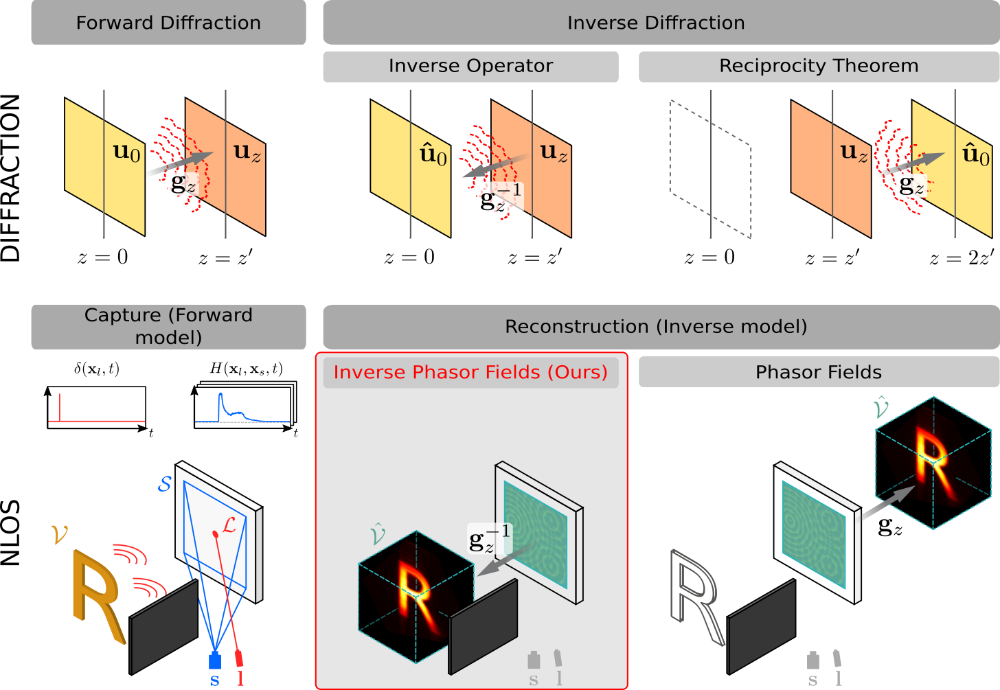
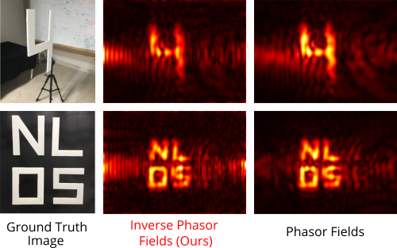

# Forward And Inverse Diffraction In Phasor Fields
This repository is the official implementation of:

<div>
    <p align="center">
        "Forward And Inverse Diffraction In Phasor Fields" (Optics Express, Vol. 33, Issue 5, 2025)
        <br />
        <a href="https://jgarciapueyo.github.io/"><strong>Jorge Garcia-Pueyo</strong></a>
        ·
        <a href="http://adolfo-munoz.com/"><strong>Adolfo Muñoz</strong></a>
    </p>
    <p align="center">
        <a href='https://opg.optica.org/oe/fulltext.cfm?uri=oe-33-5-11420&id=568850'>
        
        </a>
        <a href='https://graphics.unizar.es/projects/GarciaPueyo2025ForwardInverse/'>
        
        </a>
    </p>
</div>



Non-line-of-sight (NLOS) imaging (bottom row) is an inverse problem that consists on reconstructing a hidden scene $\mathcal{V}$ out of the direct line-of-sight given the time-resolved light signal $H(\mathbf{x}_l, \mathbf{x}_s, t)$ captured on the relay wall $\mathcal{S}$.  

This research focuses on the [Phasor Fields](https://www.nature.com/articles/s41586-019-1461-3) technique (bottom row, right section), which uses a forward diffraction operator $\mathbf{g}_z$ to reconstruct hidden scenes from time-resolved scattered light $H(\mathbf{x}_l, \mathbf{x}_s, t)$. We investigate this seemingly counterintuitive approach, using a forward operator to solve an inverse problem (reconstruction of hidden scene $\mathcal{V}$), by drawing parallels between NLOS imaging (bottom row) and diffraction (top row), more especifically between Phasor Fields and inverse diffraction methods. We reach the following contributions:
1. We relate Phasor Fields to the Reciprocity Theorem in diffraction, since both methods allow to solve the inverse problem using a forward operator. From this insight, we propose novel interpretations of the relay wall's function as either a phase conjugator or a hologram recorder, framing NLOS imaging as an inverse diffraction problem.
2. We introduce "Inverse Phasor Fields", a new algorithm to reconstruct the hidden scene posing the NLOS imaging problem as an inverse diffraction problem, using the inverse diffraction operator $\mathbf{g}^{-1}_z$.
3. We present a computational metric to assess the quality and limitations of NLOS reconstruction setups, based on the diffraction operator expressed in matricial form, and we relate it to the established Rayleigh criterion.

### Results
We show a comparison of hidden object reconstructions of (up) *letter4* and (bottom) *NLOSletter* scenes, from [Liu *et al.* dataset](https://biostat.wisc.edu/~compoptics/phasornlos20/fastnlos.html), with Phasor Fields and our method, Inverse Phasor Fields.

<div align="center">
    
</div>

Scenes have been illuminated with a single virtual wavelength $\lambda_v = 0.06m$. We show the amplitude of the reconstructed wavefield (similar to $\mathcal{V}$). The geometry part of the reconstruction are similar for both methods, but the surrounding artifacts vary between Phasor Fields and Inverse Phasor Fields. This is due to the stability of the inverse diffraction operator $\mathbf{g}_z$. For more results, including the analysis of our new quality metric, please see the [paper](https://opg.optica.org/oe/fulltext.cfm?uri=oe-33-5-11420&id=568850).

### Citation
```bibtex
@article{garciapueyo2025forwardinverse,
    title = {Forward and inverse diffraction in phasor fields},
    author = {Jorge Garcia-Pueyo and Adolfo Mu\~{n}oz},
    journal = {Opt. Express},
    volume = {33},
    number = {5},
    pages = {11420--11441},
    publisher = {Optica Publishing Group},
    month = {Mar},
    year = {2025},
    url = {https://opg.optica.org/oe/abstract.cfm?URI=oe-33-5-11420},
    doi = {10.1364/OE.553755},
}
```

## Replicating the results
The recommended way to run the scripts to replicate the results is:
1. Set up a Python virtual environment and install dependencies.
2. Download the required NLOS capture data (both real and simulated).
3. Run the scripts to reconstruct the hidden scenes using Phasor Fields and **Inverse Phasor Fields**.

#### 1. Set up the virtual environment and install the dependencies
```bash
python3 -m venv venv
source venv/bin/activate
pip install -r requirements.txt
```

#### 2. Download the NLOS capture data (real and simulated)
Our reconstruction algorithms are tested on:
- Real data: from [Phasor Field Diffraction Based Reconstruction for Fast Non-Line-of-Sight Imaging Systems](https://biostat.wisc.edu/~compoptics/phasornlos20/fastnlos.html): download it from this [link](https://biostat.wisc.edu/~compoptics/phasornlos20/archive/tdata.zip).
- Simulated data: generated using [*mitransient*](https://github.com/diegoroyo/mitransient) and [*y-tal*](https://github.com/diegoroyo/tal/). Download it from this [link](https://nas-graphics.unizar.es/s/ifg3iN3b3qSLNao).You can also generate new simulations following the steps in [How to simulate new scenes](#4-how-to-simulate-new-scenes).

The download instructions are:
1. Create a `data/` folder:
```bash
mkdir data/
```
2. Download the real data:
```bash
wget -O data/pfdiffraction_fastnlos.zip https://biostat.wisc.edu/~compoptics/phasornlos20/archive/tdata.zip
unzip data/pfdiffraction_fastnlos.zip -d data/pfdiffraction_fastnlos
```
3. Download the simulated data:
```bash
wget -O data/ForwardInverseDiffractionInPhasorFields_SimulatedData.zip https://nas-graphics.unizar.es/s/ifg3iN3b3qSLNao/download/ForwardInverseDiffractionInPhasorFields_SimulatedData.zip
unzip data/ForwardInverseDiffractionInPhasorFields_SimulatedData.zip -d data/simulated
```

#### 3. Running the scripts
This repository contains scripts to reproduce different results shown in the paper. The core functionalities for forward and inverse diffraction operators are implemented in:
- `utils_diffraction.py`
- `utils_diffraction_inverse.py`
- `utils_nlos.py`
The following main scripts process the data from `data/` and reconstruct the hidden scenes using tools from the `utils_*.py` files:
- `inverse_phasor_fields.py`
- `inverse_phasor_fields_plotmulti.py`
- `computational_metric.py`
- `computational_metric_plot.py`

##### Reconstruction with Inverse Phasor Fields
`inverse_phasor_fields.py` reconstructs hidden scenes from captured (or simulated) time-resolved data. Parameters for three different scene types are defined within:
- Lines 537-598: reconstructions with real data (replicates Figures 4, 5, and 6).
- Lines 600-618: reconstructions with simulated data of letter R scene at different depths (Figures 7, 8, and 9).
- Lines 620-637: reconstructions with simulated data of occlusions scene (Figure 10).  

To run the reconstructions:
```bash
python inverse_phasor_fields.py
```
This script creates a `results/` directory where it stores single-wavelength reconstructions using both Phasor Fields (forward diffraction) and Inverse Phasor Fields (inverse diffraction). For multiple wavelength, the `inverse_phasor_fields.py` file must be run (it reads the single wavelength reconstructions and composes it to create the multiwavelength reconstruction).

#### Computational Metric for NLOS Limits
`computational_metric.py` computes a computational metric based on the relative rank of the forward diffraction operator, considering aperture size, wavelength, and distance (parameters in the Rayleigh criterion, as shown in Eq. 30). The results are then visualized using `computational_metric_plot.py`.

To run the computational metric analysis, execute:
```bash
python computational_metric.py
python computational_metric_plot.py
```
This will generate a `results/` folder (if it does not exist) where the computational metric results are stored as `.npy` files, and the plots are saved as `.pdf` files.

#### 4. How to simulate new scenes
We provide simulated time-resolved data (impulse response function of the simulated hidden scenes) for:
- Letter R at different depths with different aperture sizes (`data/simulated/R_*m`).
- An occluded scene (`data/simulated/occlusion`).

To generate new NLOS hidden scene data, use our tool [*y-tal*](https://github.com/diegoroyo/tal/) by running:
```bash 
tal render
```
For further details, visit the [*y-tal*](https://github.com/diegoroyo/tal/) repository.